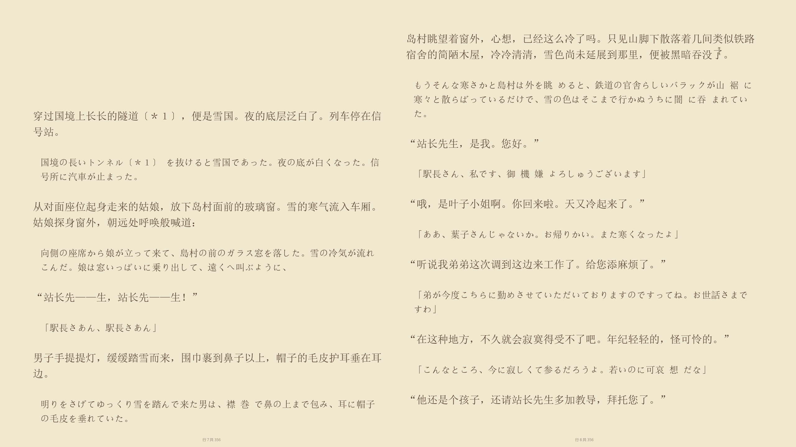

# 文译

[English](../../README.md) | **简体中文**



将多语言 EPUB、FB2、TXT、Markdown、HTML 和 PDF 小说翻译为中文的命令行工具。它以长篇小说的翻译质量为重点：全书预扫、滚动上下文、实时术语库、润色和审校均可按需启用。

## 快速开始

需要 Python 3.10+ 与 [uv](https://docs.astral.sh/uv/)。

```bash
uv sync
export DEEPSEEK_API_KEY=sk-...
uv run trans-novel translate book.epub
```

翻译完成后，默认在源文件所在目录的 `output/` 中生成单语中文版 `book.zh.epub`；也可按需生成原文对照版 `book.zh-bi.epub`。运行状态、章节 JSON、术语库和报告写入 `state/`。中断后可继续：

```bash
uv run trans-novel resume book.epub
uv run trans-novel status book.epub
```

## 支持范围

- 输入：EPUB、FB2、TXT、Markdown、HTML、PDF。
- 输出：默认生成单语 EPUB，可选双语对照版；也可导出 TXT、HTML 或 Markdown。
- PDF：首次读取通过 MinerU 转换为 `state/<书名>/source/converted.html`，需设置 `MINERU_API_KEY`；后续运行直接复用该缓存。
- EPUB：尽量保留原书样式、图片、目录与锚点；译文元数据默认设为简体中文，并将竖排样式转为横排。
- 语言：默认由模型识别源语言，也可在 `config.yaml` 固定为语言代码。

可通过命令行临时选择产物：

```bash
uv run trans-novel translate book.epub --bilingual           # 同时生成单语版和双语版
uv run trans-novel translate book.epub --no-mono --bilingual # 仅生成双语版
```

双语版默认译文在上、原文在下，可在 `config.yaml` 中将 `output.bilingual_order` 改为 `source_first`。

## 文档

- [使用指南](usage.md)：安装、Windows 使用、输入输出、续跑和工具命令。
- [配置说明](configuration.md)：模型、源语言、流水线开关、切分与路径配置。
- [翻译流程](pipeline.md)：预扫、术语、上下文、润色、审校和断点续跑如何协作。
- [贡献指南](CONTRIBUTING.md)：开发、测试和贡献要求。

公版书翻译生成的状态目录可在 [wenyi-bookcase](https://github.com/BigDawnGhost/wenyi-bookcase) 查看，也欢迎提交分享；请勿提交或分享无授权的版权文本、私人书籍或包含敏感信息的 `state/` 目录。

## 憧憬与不足

本项目为作者个人兴趣所开发，仅在于针对长文本书籍的译介做出一份微薄的努力，未来想让翻译在够准确的前提下更加顺畅，努力从可读向好读迈进。现阶段翻译文本一些口头禅前后翻译不一致，专有名词翻译不准确的问题，已经改进！如果还有什么问题，可以提交issue，如果你有什么想法，欢迎在讨论区提出，如果你有一定的编程能力，欢迎给我提交PR，让这个项目变得更好。👏

项目社区：

- [加入文译 Discord 服务器](https://discord.gg/Tybfva4HT)
- QQ 群：1055065098

## 星标历史

<a href="https://www.star-history.com/?repos=BigDawnGhost%2FWenyi&type=date&legend=top-left">
 <picture>
   <source media="(prefers-color-scheme: dark)" srcset="https://api.star-history.com/chart?repos=BigDawnGhost/Wenyi&type=date&theme=dark&legend=top-left&sealed_token=VFuKZdjDh-9e2mG4qlvqeSpCkWCoRf9ZRy0hIDLdaECFQeoNNlQ20QxSD4PuvTZp1RJg7J2s5hr57Eq66paMrhikuuI3kc41uZZCYb-bTqsUafeSB7AVdhw7bmz70NhkVXABHtSIHdw0DROZaInmznYJ651gP2klEeW8OOM8EkfJnXgDld6f0xn8mIJ9" />
   <source media="(prefers-color-scheme: light)" srcset="https://api.star-history.com/chart?repos=BigDawnGhost/Wenyi&type=date&legend=top-left&sealed_token=VFuKZdjDh-9e2mG4qlvqeSpCkWCoRf9ZRy0hIDLdaECFQeoNNlQ20QxSD4PuvTZp1RJg7J2s5hr57Eq66paMrhikuuI3kc41uZZCYb-bTqsUafeSB7AVdhw7bmz70NhkVXABHtSIHdw0DROZaInmznYJ651gP2klEeW8OOM8EkfJnXgDld6f0xn8mIJ9" />
   
 </picture>
</a>
